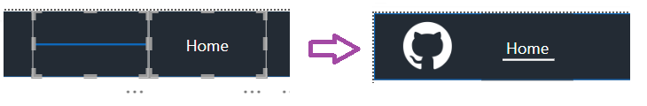
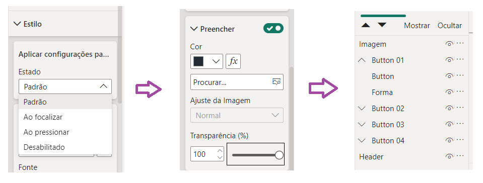
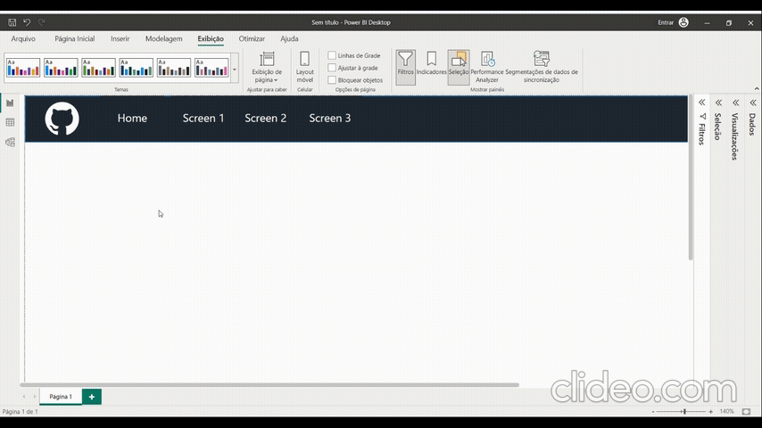

# Underline Hover Effect in Button

We can create an underline hover effect natively in Power BI. First just insert a button and a line, adjust the colors of both objects (for this solution the button must have the same fill as the background color where it will be), after that align the objects.
<h1 align="left">
  
</h1>

Order the line behind the button, then select the button and change the fill color to transparent.
<h1 align="left">
  
</h1>

Group both objects together and your hover underlined button is complete.
<h1 align="left">
  
</h1>

## Downloads
<a href="assets/pbix/Button_Underlined_HoverEffect.pbix" download>File with example</a>
